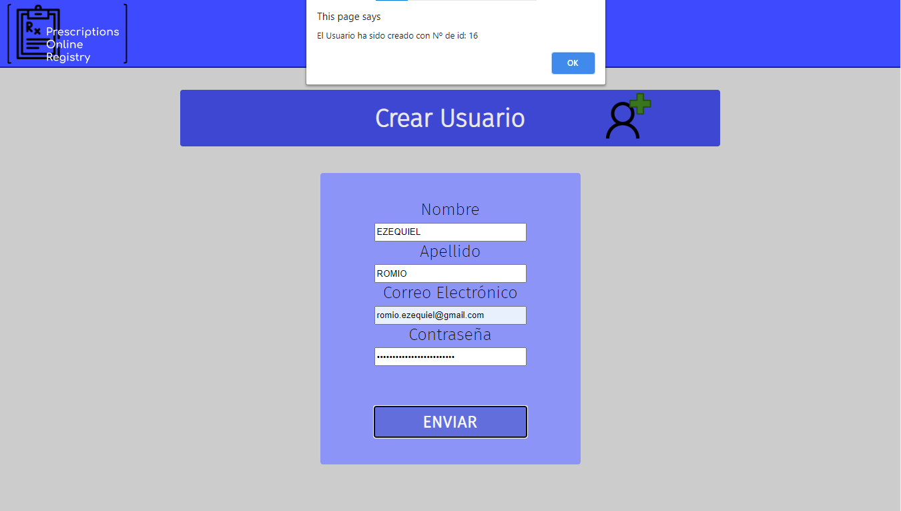

# api_interface


_Website for Opticians & Optometrist data registry_

## User's menu


### Management of user's data 

# Example

## Loading up a new optometrist patient

### Create a new user


### Go to the Prescription's menu


### Choose the user's id, and load up a new prescription


### Request Prescription's by user's id and check patient's record  


### Installation 🔧
 - Install & run _users_api_ from https://github.com/EzequielRomio/users_api
 - Open ```index.html``` with your favourite browser